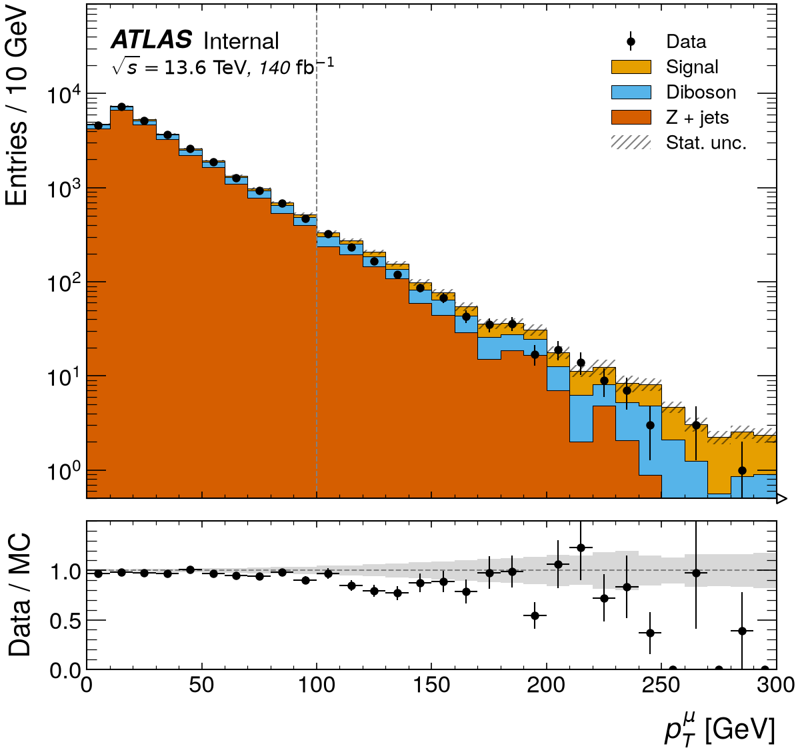
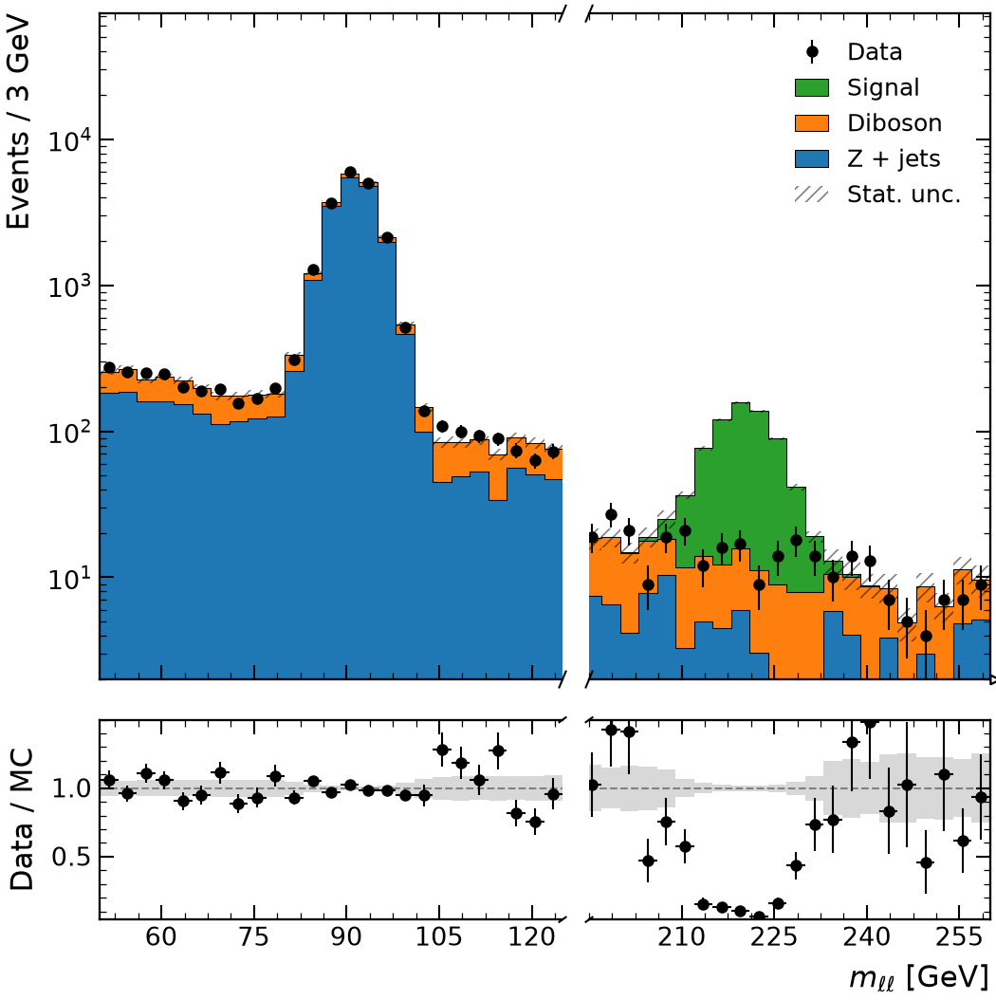
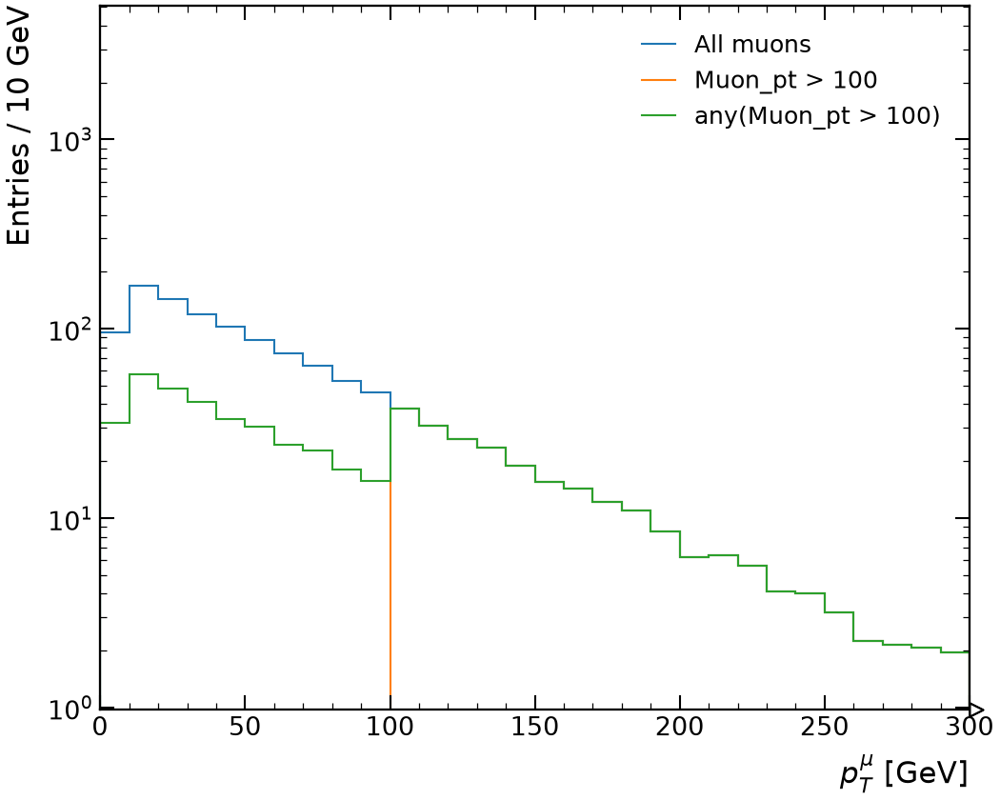

# rootfig

**Publication-quality figures straight from ROOT trees, without ROOT.**

`rootfig` is the `TTree::Draw` workflow for the Scientific Python HEP stack:
give it ROOT files, a tree, an expression, a selection and a weight, and get a
styled matplotlib figure back in one call. It reads with
[uproot](https://github.com/scikit-hep/uproot5), computes with
[Awkward Array](https://github.com/scikit-hep/awkward), fills
[hist](https://github.com/scikit-hep/hist) histograms and draws with
[mplhep](https://github.com/scikit-hep/mplhep). It adds the missing glue:
predictable per-event/per-object selection semantics, weights, shared
binning across samples, normalisation, ratio panels and good defaults.

[](https://github.com/jbeirer/rootfig/actions/workflows/ci.yml)
[](https://codecov.io/gh/jbeirer/rootfig)
[](https://pypi.org/project/rootfig/)
[](https://pypi.org/project/rootfig/)
[](LICENSE)

```python
import rootfig as rf

rf.plot("events.root", "Muon_pt", tree="events", selection="Muon_pt > 20", bins=50)
```

<p align="center">
  
  
</p>
<p align="center">
  
  
</p>

These and a dozen more figures, each next to the code that made it, are in the
[gallery](https://jbeirer.github.io/rootfig/gallery/). All of them come from
[`examples/gallery`](examples/gallery/__init__.py), which writes toy ROOT files and
draws every example in a few seconds; the same figures are pixel-compared in CI.

## Installation

```bash
pip install rootfig
# or
uv add rootfig
```

Python 3.12 or newer. No ROOT installation is needed; `TTree` and `RNTuple`
files are both supported.

## Quick start

```python
import rootfig as rf

# Overlay two samples, normalised to unity, with a ratio panel.
rf.plot(
    ["signal.root", "background.root"],
    "Muon_pt",
    tree="events",
    selection="abs(Muon_eta) < 2.5",
    weight="event_weight",
    bins=(50, 0, 200),
    normalize=True,
    ratio=True,
)
```

For analysis scripts with many samples, variables and plots, describe things
once and reuse them:

```python
import rootfig as rf

signal = rf.Sample("sig_*.root", tree="events", label="Signal", weight="mc_weight")
background = rf.Sample("bkg.root", tree="events", label="Background", weight="mc_weight")
data = rf.Sample("data.root", tree="events", label="Data", is_data=True)

pt = rf.Variable("Muon_pt", bins=(50, 0, 200), label=r"$p_T^{\mu}$", unit="GeV")
baseline = rf.Cut("nMuon >= 1") & "abs(Muon_eta) < 2.5"
style = rf.Style(experiment="ATLAS", status="Internal", lumi=140, com=13.6)

p = rf.plot(
    [background, signal],
    pt,
    observed=data,
    selection=baseline,
    stack=True,
    ratio=True,
    logy=True,
    style=style,
)
p.ax.set_ylim(top=1e5)  # it is a normal matplotlib Axes
p.save("muon_pt.pdf")
```

Everything you get back is a standard object: `p.fig` and `p.ax` are
matplotlib `Figure`/`Axes`, `p.hists` are `hist.Hist` objects, and
`rf.load(...)` returns Awkward arrays.

## Features

- **One call from files to figure**, reading only the branches the expressions need.
- **Expressions in Python syntax**: `sqrt(px**2 + py**2)`, `count(Jet_pt) >= 2`,
  `` `jet1_b-tag` > 0.5 ``, `and`/`or`/`not`, chained comparisons.
- **Jagged branches done right**: per-object cuts mask objects, per-event
  cuts drop events, ambiguous combinations raise a clear error instead of
  silently broadcasting.
- **Weights**: per-event weights broadcast onto objects, per-object weights,
  constant scale factors, multiplicative combination of sample and plot weights.
- **Histograms with uncertainties** (`hist` with `Weight` storage), shared
  binning across samples, automatic or robust ranges, log bins, flow bins.
- **Overlays, stacks, data points, ratio panels** with correct error
  propagation for weighted histograms and a reference-uncertainty band.
- **Normalisation**: to unity, density, per bin width, or to a number; or to
  a **luminosity** from cross sections and generated-event counts
  (`Sample(xsec="0.2 pb", ngen="eventsProcessed")`, `lumi="10.8 ab^-1"`).
- **Analysis tables and panels**: cut flows with yields and efficiencies,
  significance panels (S/√B), efficiency-versus-variable plots with binomial
  intervals, profiles and resolutions.
- **Experiment-neutral defaults**, with mplhep styles and labels for ATLAS,
  CMS, LHCb, ALICE and DUNE one keyword away; any other experiment name, GeV
  and ab⁻¹ work too.
- **EDM4hep-friendly**: sub-branches of split collections are addressed as
  `ReconstructedParticles.momentum.x`, with `pt`, `p`, `theta`, `costheta`,
  `eta`, `phi` and `mass` helpers.
- **Also**: 2D histograms, summary statistics tables, statistics boxes,
  correlation matrices, multi-file globs, entry ranges for quick looks.

## Documentation

- [Quick start](docs/quickstart.md)
- [Expressions and selections](docs/expressions.md)
- [Samples, variables, cuts and styles](docs/composable.md)
- [Plotting options](docs/plotting.md)
- [Relation to uproot, Awkward, hist, mplhep and matplotlib](docs/ecosystem.md)

## Relation to the ecosystem

`rootfig` does not replace any of the libraries it builds on:

| Task | Library | What rootfig adds |
| --- | --- | --- |
| Reading ROOT files | uproot | file globs, tree auto-detection, reading only the required branches |
| Jagged arrays | Awkward Array | the per-event/per-object rules for cuts and weights |
| Histograms | hist / boost-histogram | shared binning, automatic ranges, normalisation, ratios |
| Drawing | mplhep + matplotlib | overlays, stacks, ratio panels, labels and legends with good defaults |

If you already have `hist.Hist` objects, `rf.plot_histograms` draws them with
the same options. If you want the arrays, `rf.load` returns them.

## Development

```bash
git clone https://github.com/jbeirer/rootfig
cd rootfig
uv sync --all-groups
uv run pytest
uv run ruff check . && uv run ruff format --check .
uv run mypy
```

See [CONTRIBUTING.md](CONTRIBUTING.md) for details.

## License

MIT. See [LICENSE](LICENSE).
