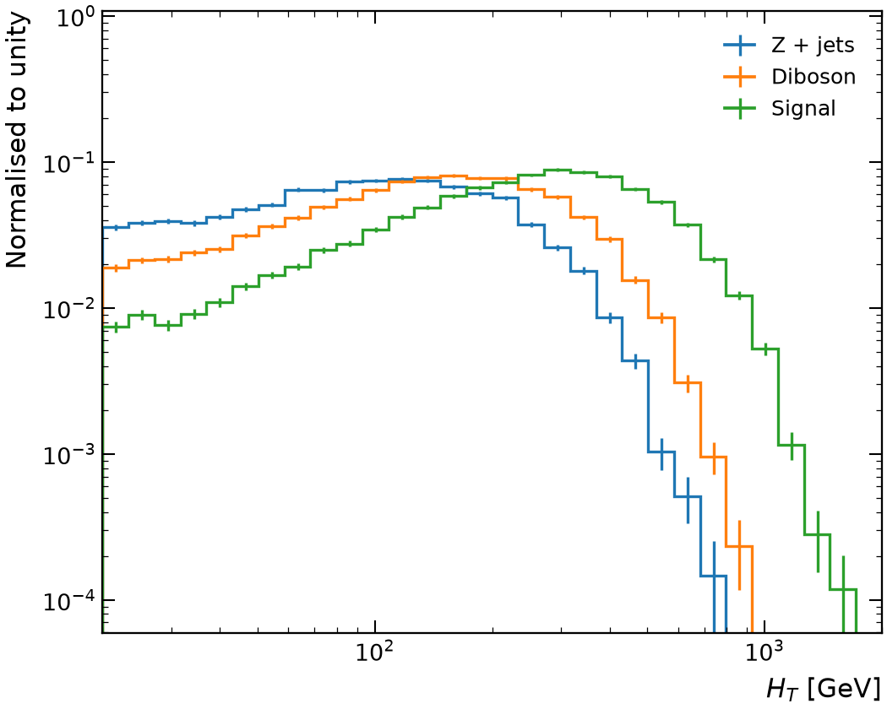
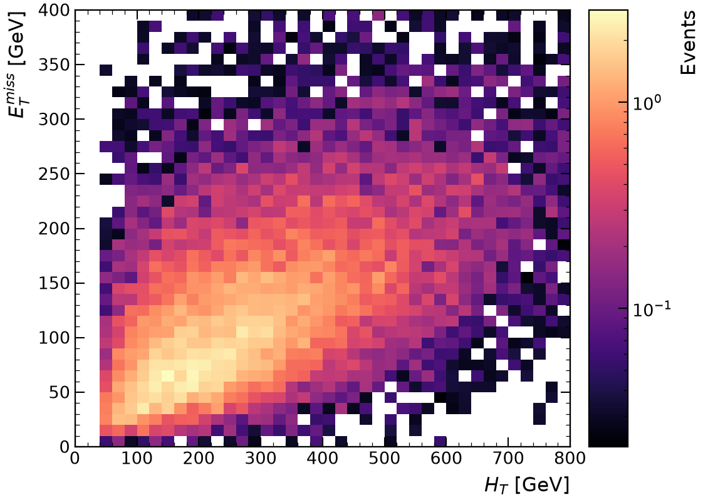
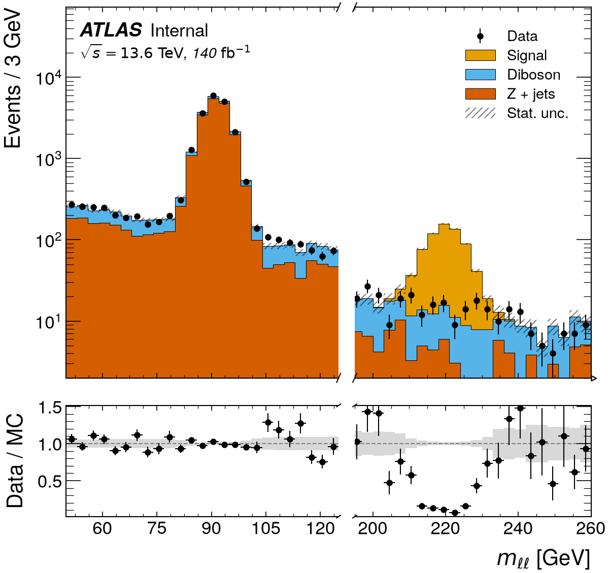
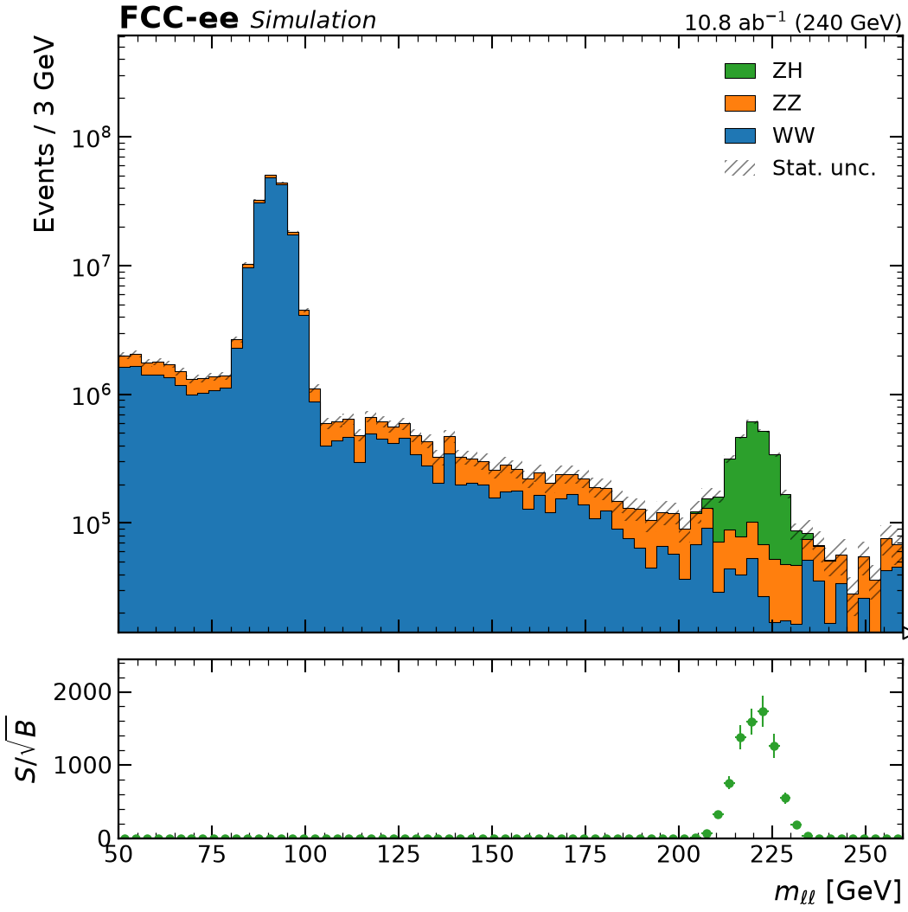

<p align="center">
  <picture>
    <source media="(prefers-color-scheme: dark)" srcset="https://raw.githubusercontent.com/jbeirer/rootfig/main/.github/assets/rootfig-logo-dark.svg">
    <source media="(prefers-color-scheme: light)" srcset="https://raw.githubusercontent.com/jbeirer/rootfig/main/.github/assets/rootfig-logo-light.svg">
    
  </picture>
</p>

<p align="center">
  <strong>Publication-quality figures straight from ROOT trees and histograms, without ROOT.</strong>
</p>

<p align="center">
  <a href="https://jbeirer.github.io/rootfig/">Documentation</a> ·
  <a href="https://jbeirer.github.io/rootfig/gallery/">Gallery</a> ·
  <a href="https://jbeirer.github.io/rootfig/quickstart/">Quick start</a>
</p>

<p align="center">
  <a href="https://jbeirer.github.io/rootfig/"></a>
  <a href="https://doi.org/10.5281/zenodo.22726311"></a>
  <a href="https://github.com/jbeirer/rootfig/actions/workflows/ci.yml"></a>
  <a href="https://github.com/jbeirer/rootfig/actions/workflows/key4hep.yml"></a>
  <a href="https://codecov.io/gh/jbeirer/rootfig"></a>
  <a href="https://pypi.org/project/rootfig/"></a>
  <a href="https://pypi.org/project/rootfig/"></a>
  <a href="LICENSE"></a>
</p>

Go from a ROOT file to a styled figure in one call. Choose a variable, add a
selection, and plot:

```python
import rootfig as rf

rf.plot("events.root", "Muon_pt", tree="events", selection="Muon_pt > 20", bins=50)
```

Start with a single distribution; add samples, weights, stacks and ratio
panels as your analysis grows. Every plot gives you a matplotlib figure to
customise and save.

<p align="center">
  <a href="https://jbeirer.github.io/rootfig/gallery/log_axes/"><picture><source media="(prefers-color-scheme: dark)" srcset="docs/images/gallery/log_axes-dark.png"></picture></a>
  &nbsp;&nbsp;
  <a href="https://jbeirer.github.io/rootfig/gallery/hist2d/"><picture><source media="(prefers-color-scheme: dark)" srcset="docs/images/gallery/hist2d-dark.png"></picture></a>
</p>
<p align="center">
  <a href="https://jbeirer.github.io/rootfig/gallery/xbreak_ratio/#atlas"><picture><source media="(prefers-color-scheme: dark)" srcset="docs/images/gallery/xbreak_ratio-atlas-dark.png"></picture></a>
  &nbsp;&nbsp;
  <a href="https://jbeirer.github.io/rootfig/gallery/luminosity/"><picture><source media="(prefers-color-scheme: dark)" srcset="docs/images/gallery/luminosity-dark.png"></picture></a>
</p>

**[Explore the gallery →](https://jbeirer.github.io/rootfig/gallery/)**
See each figure alongside the code that makes it, from simple overlays to
stacked data/MC comparisons, broken axes and 2D histograms, in the neutral
style or in that of ATLAS, CMS, LHCb, ALICE or DUNE.

## Installation

```bash
pip install rootfig
# or
uv add rootfig
```

Python 3.12 or newer. No ROOT installation is needed; `TTree` and `RNTuple`
files and stored `TH1`/`TH2` histograms are all supported.

## Compare samples in one call

```python
import rootfig as rf

# Overlay two samples, each normalised to unity, with a Signal / Background panel.
rf.plot(
    {"Signal": "signal.root", "Background": "background.root"},
    "Muon_pt",
    tree="events",
    selection="abs(Muon_eta) < 2.5",
    weight="event_weight",
    bins=(50, 0, 200),
    normalize=True,
    ratio="Background",
)
```

## Build up to a full analysis

Define samples, variables, cuts and styles once, then reuse them across plots:

```python
import rootfig as rf

signal = rf.Sample("sig_*.root", tree="events", label="Signal", weight="mc_weight")
background = rf.Sample("bkg.root", tree="events", label="Background", weight="mc_weight")
data = rf.Sample("data.root", tree="events", label="Data", is_data=True)

pt = rf.Variable("Muon_pt", bins=(50, 0, 200), label=r"$p_T^{\mu}$", unit="GeV")
baseline = rf.Cut("nMuon >= 1") & "abs(Muon_eta) < 2.5"
style = rf.Style(experiment="ATLAS", status="Internal", lumi=140, com=13.6)

p = rf.plot(
    [background, signal],
    pt,
    observed=data,
    selection=baseline,
    stack=True,
    ratio=True,
    logy=True,
    style=style,
)
p.ax.set_ylim(top=1e5)  # it is a normal matplotlib Axes
p.save("muon_pt.pdf")
```

Everything you get back is a standard object: `p.fig` and `p.ax` are
matplotlib `Figure`/`Axes`, `p.hists` are `hist.Hist` objects, and
`rf.load(...)` returns Awkward arrays.

For histogram files, `Group` sums processes and a `Variable` crops and merges
their bins just as it bins a tree. `PlotBook` draws the variants from one
preparation; `rf.ALL` discovers every shared histogram for an overview.

```python
# Histogram files: one per process, already scaled to 5 ab^-1
ww = rf.Sample("outputs/p8_ee_WW_ecm240.root", label="WW")
zz = rf.Sample("outputs/p8_ee_ZZ_ecm240.root", label="ZZ")
zh = rf.Sample("outputs/p8_ee_ZH_ecm240.root", label="ZH")
fcc = rf.Style(experiment="FCC-ee", status="Simulation", com="240 GeV", lumi="5 ab^-1")

book = rf.PlotBook(
    [rf.Group([ww, zz], label="VV"), zh],
    [rf.Variable("zmumu_recoil_m", bins=(200, 120, 140), label="Recoil mass", unit="GeV")],
    variants={"stack": {"stack": True}, "nostack": {"stack": ["VV"]}},
    plot_kwargs={"style": fcc},
)
book.save_pdf("zh.pdf")  # rf.ALL in place of the list plots every histogram the files share
```

## What you can do

- **Select events and objects with readable expressions.** Write cuts such as
  `count(Jet_pt) >= 2` or `Muon_pt > 20`; event and object selections have
  explicit rules, and event weights carry through to each selected object.
- **Compare samples with a few keywords.** Overlays, stacks, data points and
  ratio panels share binning and propagate histogram uncertainties; bin edges
  and `(n, low, high)` are used as given, while a range inferred from the data
  ignores far outliers, so `-999` sentinels do not set the axis. Normalise to
  unity, density, bin width or luminosity; stack some samples and overlay the rest.
  Draw several samples as one histogram with `rf.Group`, each keeping its own
  weights, cross section and systematics.
- **Show systematic uncertainties.** Attach weight, branch, file or
  normalisation variations to a sample; stacks and ratio panels draw the
  combined statistical and systematic band, and every component stays
  accessible.
- **Style figures for your analysis.** Add experiment labels, units, log axes
  and broken axes, then refine the result with matplotlib.
- **Produce whole sets of plots.** `rf.PlotBook` runs one `rf.plot` call over
  variables × selections × variants, lazily, and saves each under a
  deterministic name or all of them as one multipage PDF; `rf.ALL` discovers
  the variables from the files, and `select()` filters the book down while
  iterating on a plot.
- **Go beyond 1D plots.** Draw 2D histograms, correlations, efficiencies,
  profiles, resolutions and significance panels; produce cut flows and
  summary statistics from the same inputs.
- **Work directly with your files.** Read `TTree` and `RNTuple` data, combine
  files with globs, limit entry ranges for quick checks, and use EDM4hep
  split collections. Only the branches your expressions need are read.

## Documentation

**[Read the docs](https://jbeirer.github.io/rootfig/)** or
**[browse the gallery](https://jbeirer.github.io/rootfig/gallery/)** for examples
with figures and code.

- [Quick start](https://jbeirer.github.io/rootfig/quickstart/): your first plot, selections and weights.
- [Expressions and selections](https://jbeirer.github.io/rootfig/expressions/): syntax and event/object rules.
- [Samples, variables, cuts and styles](https://jbeirer.github.io/rootfig/composable/): reusable analysis definitions.
- [Plotting options](https://jbeirer.github.io/rootfig/plotting/): binning, normalisation, panels and styling.
- [API reference](https://jbeirer.github.io/rootfig/api/): full signatures and options.

## Relation to the ecosystem

`rootfig` brings a `TTree::Draw`-like workflow to the Scientific Python HEP
stack, building on familiar libraries:

| Task | Library | What rootfig adds |
| --- | --- | --- |
| Reading ROOT files | [uproot](https://github.com/scikit-hep/uproot5) | file globs, tree auto-detection, reading only the required branches |
| Jagged arrays | [Awkward Array](https://github.com/scikit-hep/awkward) | the per-event/per-object rules for cuts and weights |
| Histograms | [hist](https://github.com/scikit-hep/hist) / boost-histogram | shared binning, robust automatic ranges, normalisation, ratios |
| Drawing | [mplhep](https://github.com/scikit-hep/mplhep) + matplotlib | overlays, stacks, ratio panels, labels and legends with good defaults |

If your histograms already exist, `rf.plot` draws them too: name a `TH1`
stored in the file instead of a branch (`rf.plot("zh_histo.root", "m_recoil")`),
or pass `hist.Hist` objects directly. If you want the arrays, `rf.load` returns them. See
[the ecosystem guide](https://jbeirer.github.io/rootfig/ecosystem/) for details.

## Development

```bash
git clone https://github.com/jbeirer/rootfig
cd rootfig
uv sync --all-groups
uv run pytest
uv run ruff check . && uv run ruff format --check .
uv run mypy
```

See [CONTRIBUTING.md](CONTRIBUTING.md) for details.

## Citation

If `rootfig` is useful in your research, please cite it:

```bibtex
@software{rootfig,
  author = {Beirer, Joshua Falco},
  doi = {10.5281/zenodo.22726311},
  license = {MIT},
  title = {{rootfig}},
  url = {https://github.com/jbeirer/rootfig},
  year = {2026}
}
```

## License

MIT. See [LICENSE](LICENSE).
